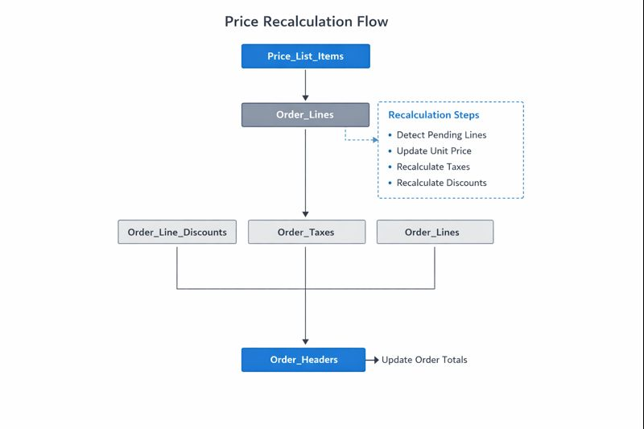

# Price Update Recalculation (SQL Server) – Pending Orders

## Overview
This project contains a SQL Server stored procedure that **recalculates pending sales orders** when the stored unit price on order lines differs from the **current price list**.

The procedure:
1. Detects pending order lines (not fully invoiced/delivered) with outdated prices  
2. Updates the unit price based on the selected price list(s)  
3. Recalculates dependent financial fields:
   - taxes (line and header)
   - discounts (line and header)
   - gross/net subtotals
   - order header totals  

> **Disclaimer:** All table names, schemas, fields and any business identifiers have been **fully anonymized** to preserve confidentiality and comply with data protection policies. This repository is for demonstration purposes only.

---

## Architecture & Data Flow



This stored procedure represents a batch data engineering process that ensures pricing consistency across transactional sales data.

Main flow:
- Detect pending order lines with outdated prices  
- Synchronize unit prices with the active price list  
- Recalculate taxes, discounts and net/gross subtotals  
- Update order header totals and tax breakdowns  

The process maintains financial integrity across order headers, lines, discounts and tax tables within a single transactional scope.

This batch process is designed to be executed periodically or triggered on demand as part of a pricing synchronization pipeline.

---

## Business Impact

This process helps:
- Prevent billing errors caused by outdated price lists  
- Ensure financial consistency across open sales orders  
- Reduce manual recalculation effort by automating price synchronization  
- Improve data quality in downstream reporting and invoicing processes  

---

## Business Problem
In many ERP environments, sales orders may remain open for days or weeks. During that period, price lists can change, causing discrepancies between:
- the stored order line unit price and  
- the current price list price  

This procedure helps ensure that **pending orders reflect up-to-date pricing** and that all dependent financial values are recalculated consistently.

---

## Key Features
- Transaction-safe execution (`BEGIN TRAN`, `XACT_ABORT ON`)  
- Targets only **pending** lines (ordered > invoiced and ordered > delivered)  
- Recalculates:
  - unit tax amounts  
  - gross subtotals (excl/incl tax)  
  - line discounts (excl/incl tax)  
  - net subtotals (excl/incl tax)  
  - net unit price  
  - order header totals  
  - line/header tax bases and tax amounts  
- Returns a summary of affected lines/orders and updated rows per step  

---

## Parameters
- `@StartDate`: minimum issue date for orders to be considered  
- `@Divisions`: comma-separated list of division IDs  
- `@OrderTypes`: comma-separated list of order types  
- `@ProductType`: optional filter for product type  
- `@PriceLists`: comma-separated list of price list IDs  
- `@OrderNumber`: optional filter for a specific order number  
- `@ProductCode`: optional filter for a specific product  

---

## How to Run (example)

```sql
EXEC dbo.usp_recalculate_pending_orders
     @StartDate   = '2025-01-01',
     @Divisions   = '01,02',
     @OrderTypes  = 'NP',
     @ProductType = NULL,
     @PriceLists  = '4,7',
     @OrderNumber = NULL,
     @ProductCode = NULL;
